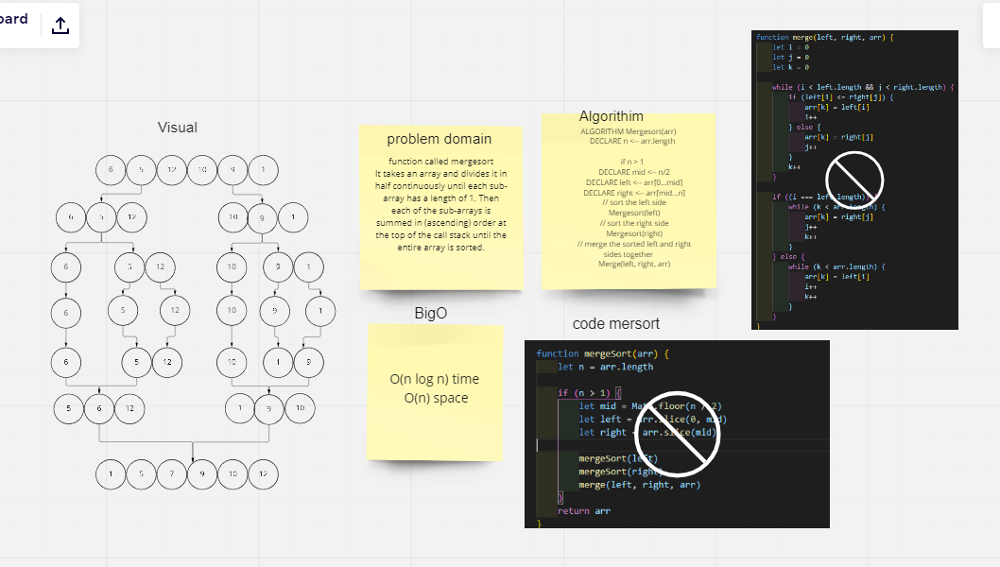

# Merge Sort
>It takes an array and divides it in half continuously until each sub-array has a length of 1. Then each of the sub-arrays is summed in (ascending) order at the top of the call stack until the entire array is sorted.

## Challenge
> 1. Write a blog post stepping through the insertion sort algorithm
  2. Code a working, tested implementation of insertion sort based on the provided pseudocode that takes in an array and returns the same array sorted.
## Approach & Efficiency
* O(n log n) time
* O(n) space

## Whiteboard

