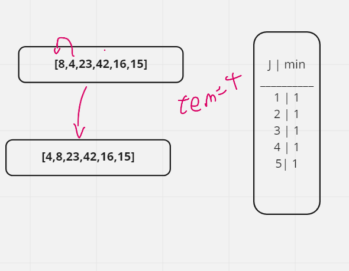
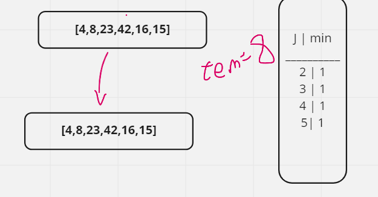
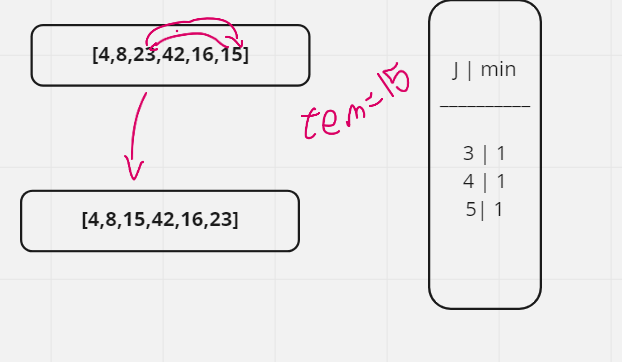
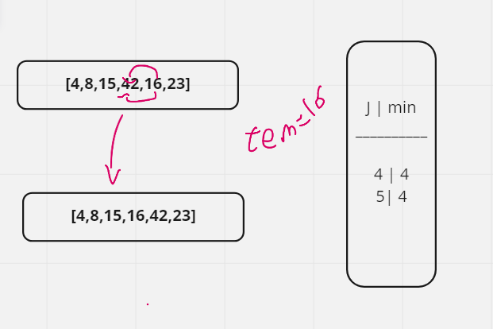
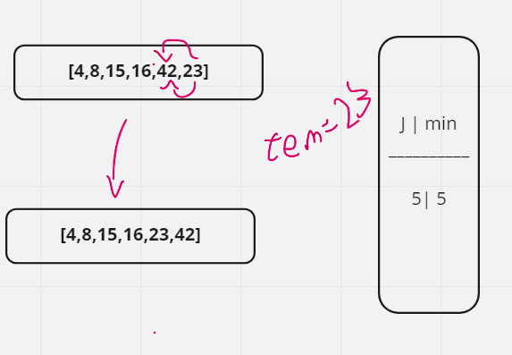

# Code Tracing 


```
InsertionSort(int[] arr)

  FOR i = 1 to arr.length

    int j <-- i - 1
    int temp <-- arr[i]

    WHILE j >= 0 AND temp < arr[j]
      arr[j + 1] <-- arr[j]
      j <-- j - 1

    arr[j + 1] <-- temp
```

### Trace
##### First Pass:


the first pass of Insertion Sort
In the first pass, we check if index 1 is less than index 0. and it is 
so we switch their places
---
##### 2nd Pass:



the 2nd pass of insertion sort

check if index 2 is less than index 1. It is not so nothing happens

---
##### 3rd Pass:



the 3rd pass of insertion sort

We check if index 3 is less than index 2. It is not so nothing happens

---
##### Fourth Pass:



the fourth pass of insertion sort

We check if index 4 is less than index 3. It is, so we perform the value movement logic across two index values and place 16 after 8.

---
##### Fifth Pass:



the firfth pass of insertion sort

We check if index 5 is less than index 4. It is, so we perform the value movement logic across three index values and place 15 after 8.
