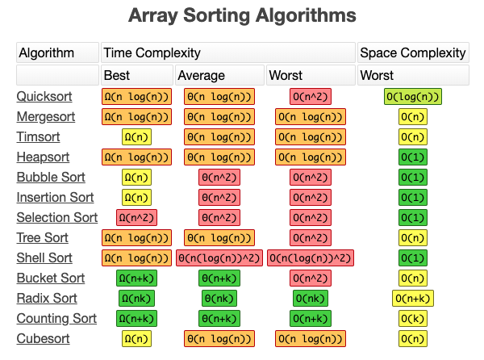

# Quick Sort

## Intro 
**In the realm of sorting the quicksort is king!**

> Quicksort is a recursive, divide-and-conquer algorithm that is ranked as fastest in its class. It boasts of an average time complexity of O (n log n ) (in big-o notation), which compared to its peers is pretty fast. Big-O notation is a way of measuring how well an algorithm scales or performs as the amount of data it processes grows.

#### Below is a chart stacking quicksort against the top sorting algorithms. As you can see, it comes in first:

## How Does it Work?
> Quicksort uses a pivot, a value often designated to be the middle or last element of an array. The algorithm compares each element of the array with the pivot, rearranging each one such that the values on one side (left) of it are smaller and those on the other side (right) are larger. It then partitions both sides and recursively runs the same process on each side until the array is sorted.

## Psuedo Code 

         ALGORITHM QuickSort(arr, left, right)
    if left < right
        // Partition the array by setting the position of the pivot value
        DEFINE position <-- Partition(arr, left, right)
        // Sort the left
        QuickSort(arr, left, position - 1)
        // Sort the right
        QuickSort(arr, position + 1, right)

        ALGORITHM Partition(arr, left, right)
    // set a pivot value as a point of reference
    DEFINE pivot <-- arr[right]
    // create a variable to track the largest index of numbers lower than the defined pivot
    DEFINE low <-- left - 1
    for i <- left to right do
        if arr[i] <= pivot
            low++
            Swap(arr, i, low)

     // place the value of the pivot location in the middle.
     // all numbers smaller than the pivot are on the left, larger on the right.
     Swap(arr, right, low + 1)
    // return the pivot index point
     return low + 1

    ALGORITHM Swap(arr, i, low)
    DEFINE temp;
    temp <-- arr[i]
    arr[i] <-- arr[low]
    arr[low] <-- temp

## Code Tracing

## BigO
- time : O(n log n) 
- space : O(n) 